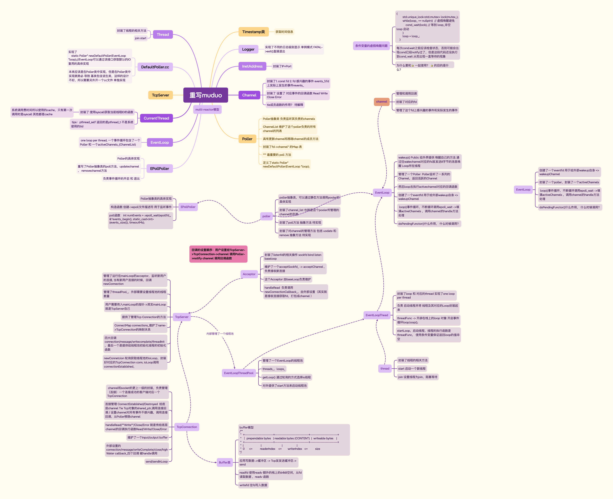

muduo网络库的重写

# 目的

1、理解阻塞、非阻塞、同步、异步

2、理解Unix/Linux上的五种IO模型

3、epoll的原理以及优势

4、深刻理解Reactor模型5、从开源C++网络库，学习优秀的代码设计

6、掌握基于事件驱动和事件回调的epoll+线程池面向对象编程

7、通过深入理解muduo源码，加深对于相关项目的深刻理解

8、改造muduo，不依赖boost，用C++11重构

# 知识储备

1、TCP协议和UDP协议

2、TCP编程和UDP编程步骤

3、IO复用接口编程select、poll、epoll编程

4、Linux的多线程编程pthread、进程和线程模型 C++20标准加入了协程的支持

# 阻塞、非阻塞、同步、异步

典型的一次IO的两个阶段 数据准备( 从设备缓冲区复制到 内核缓冲区 ）数据读写（从内核空间复制到用户空间）

数据准备： 根据系统IO操作的就绪状态

- 阻塞  调用IO方法线程进入阻塞状态
- 非阻塞 不会改变线程的状态通过返回值判断

ssize_t recv(int socked,void *buf, size_t len, int flags)

int size = recv(sockfd,buf,1024,0)

socketed 默认工作在阻塞模式， recv如果没有数据可以读 ，就会阻塞当前线程

非阻塞 recv 直接返回 通过返回值判断是否准备成功

​	size = -1 表示错误 有两种情况 1、系统错误 2、非阻塞返回

所以要继续判断

​	**size = -1 && errno = EAGAIN 非阻塞返回**

​	size = 0 网络对端关闭了连接

​	size > 0  接收到的数据字节数

数据读写：根据应用程序和内核的交互方式

- 同步 应用程序使用recv 自己把数据从 从内核空间搬移到用户空间 **recv 同步IO接口** （阻塞或者非阻塞由sockfd决定）
- 异步 操作系统负责 从内核空间搬到用户空间
  - sockfd 监听的端口
  - buf 用户程序存放数据的buf指针
  - sigio信号 通知数据读写完成
  - 当操作系统使用  sigio 信号  ***通知***  的时候表示 数据已经准备好了  （信号、回调
  - 效率高但是编程复杂

​	Linux异步IO接口 aio_read aio_write **特殊API** 

​	同步IO select poll epoll

**陈硕大神原话：在处理 IO 的时候，阻塞和非阻塞都是同步 IO。只有使用了特殊的 API 才是异步**

**IO。**

并发的同步和异步

 同步 ： **A等 B做完了 得到返回值 A 再继续执行**  

异步 ：A告诉B 感兴趣的事件以及通知方式，A操作继续执行自己的业务逻辑，等B监听到了响应的事件发生，B  **通知**  A，A再处理，

Node.js 基于异步非阻塞模式下的高性能服务器

# Unix/Linux的五种IO模型

#### 阻塞blocking 同步

| 应用进程read | 系统调用----> | 内核                   |
| ------------ | ------------- | ---------------------- |
| 阻塞...      |               | 内核准备数据           |
| 阻塞...      |               | 拷贝数据到用户进程空间 |
| 应用处理数据 | <----返回     | 拷贝成功               |

进程阻塞于read

#### 非阻塞non-blocking 同步

| 应用进程read | 系统调用----> | 内核                   |
| ------------ | ------------- | ---------------------- |
| read         | <----- EAGAIN | 准备数据               |
| Read         | <----- EAGAIN |                        |
| Read         | <----- EAGAIN |                        |
|              |               | 拷贝数据到用户进程空间 |
| 处理数据     | <----- 返回   | 拷贝完成               |

进程调用read， 判断EAGAIN 反复调用 

#### IO复用 IO multiplexing

在一个线程调用IO复用函数，可以监视一系列fd 是同步的IO接口

|      | select         | poll           | epoll                               |
| ---- | -------------- | -------------- | ----------------------------------- |
|      | 数组 长度限制  | 链表无长度限制 | 红黑树                              |
|      | 需要复制到内核 | 需要复制到内核 | 就是建立在内核内 无需复制           |
|      |                |                | 连接数量多 但是只有少部分是活跃连接 |

#### 信号驱动signal-driven

上述三种在第一种阶段要么阻塞， 要么不阻塞但是需要轮询，但是信号启动时第一步不需要轮询，但是第二步是同步的，也就是数据从内核空间搬移到用户空间的话需要花费用户程序自己的时间去做

 

内核在第一个阶段是异步，在第二个阶段是同步，区别于非阻塞IO 是他提供消息通知机制，不需要用户进程不断轮询检查，减少了API的调用次数，提高效率

#### 异步asynchronous

全都异步，第一步 第二步都是操作系统内核完成，效率高，但是编程复杂，出问题不好排查

典型的异步非阻塞状态，Node.js采用的网络IO模型。

## 好的网络服务器设计

one loop per thread is usually a good model 

这样多线程服务端编程的问题就转换为如何设计一个高效且易于使用的event loop，然后每个线程run一个event loop就行了（当然线程间的同步、互斥少不了，还有其它的耗时事件需要起另外的线程来做）。

event loop 是 non-blocking 网络编程的核心，在现实生活中，non-blocking 几乎总是和 IOmultiplexing 一起使用，原因有两点：

- 没有人真的会用轮询 (busy-pooling) 来检查某个 non-blocking IO 操作是否完成，这样太浪费CPU资源了。

- IO-multiplex 一般不能和 blocking IO 用在一起，因为 blocking IO read()/write()/accept()/connect() 都有可能阻塞当前线程，这样线程就没办法处理其他 socket上的 IO 事件了。

所以，当我们提到 non-blocking 的时候，实际上指的是 non-blocking + IO-multiplexing，单用其

中任何一个都没有办法很好的实现功能。

>  epoll + fork不如epoll + pthread？

强大的nginx服务器采用了epoll+fork模型作为网络模块的架构设计，实现了简单好用的负载算法，使各个fork网络进程不会忙的越忙、闲的越闲，并且通过引入一把乐观锁解决了该模型导致的**服务器惊群**现象，功能十分强大

## reactor模型

> The reactor design pattern is an event handling pattern for handling service requests
>
> delivered concurrently to a service handler by one or more inputs. The service handler
>
> then demultiplexes the incoming requests and dispatches them synchronously to the
>
> associated request handlers.

**重要组件**：**Event事件、Reactor反应堆、Demultiplex事件分发器、Evanthandler事件处理器**

# epoll

## select的缺点：

1、单个进程能够监视的**文件描述符的数量存在最大限制**，通常是1024，当然可以更改数量，但由于

select采用**轮询的方式扫描**文件描述符，文件描述符数量越多，性能越差；(在linux内核头文件中，有

这样的定义：#define __FD_SETSIZE 1024

2、**内核 / 用户空间内存拷贝**问题，select需要复制大量的句柄数据结构，产生巨大的开销

3、select返回的是含有整个句柄的数组，**应用程序需要遍历整个数组**才能发现哪些句柄发生了事件

4、select的触发方式是**水平触发**，应用程序如果没有完成对一个已经就绪的文件描述符进行IO操作，那么之后每次select调用还是会将这些文件描述符通知进程

## Poll

相比select模型，**poll使用链表**保存文件描述符，因此没有了监视文件数量的限制，但其他**三个缺点依然存在。**

以select模型为例，假设我们的服务器需要支持100万的并发连接，则在__FD_SETSIZE 为1024的情况

下，则我们至少需要开辟1k个进程才能实现100万的并发连接。除了进程间上下文切换的时间消耗外，

从内核/用户空间大量的句柄结构内存拷贝、数组轮询等，是系统难以承受的。因此，基于select模型的

服务器程序，要达到100万级别的并发访问，是一个很难完成的任务。

## epoll

epoll把原先的select/poll调用分成以下3个部分：

1）调用epoll_create()建立一个epoll对象（在epoll文件系统中为这个句柄对象分配资源）

2）调用epoll_ctl向epoll对象中添加这100万个连接的套接字

3）调用epoll_wait收集发生的事件的fd资源

如此一来，要实现上面说的场景，只需要在进程启动时建立一个epoll对象，然后在需要的时候向这

个epoll对象中添加或者删除事件。同时，epoll_wait的效率也非常高，因为东西都放在内核空间，因为调用epoll_wait时，并没有向操作系统复制这100万个连接的句柄数据，内核也不需要去遍历全部的连接。

## LT模式

内核数据还没读完，就会一直上报数据

## ET模式

内核数据只上报一次

### **muduo采用的是LT**

- 不会丢失数据或者消息
  - 应用没有读取完数据，内核是会不断上报的

- 低延迟处理
  - 每次读数据只需要一次系统调用；照顾了多个连接的公平性，不会因为某个连接上的数据量过大而影响其他连接处理消息

- 跨平台处理
  - 像select一样可以跨平台使用

## muduo网络库的核心模块

Channel

## 总结         

